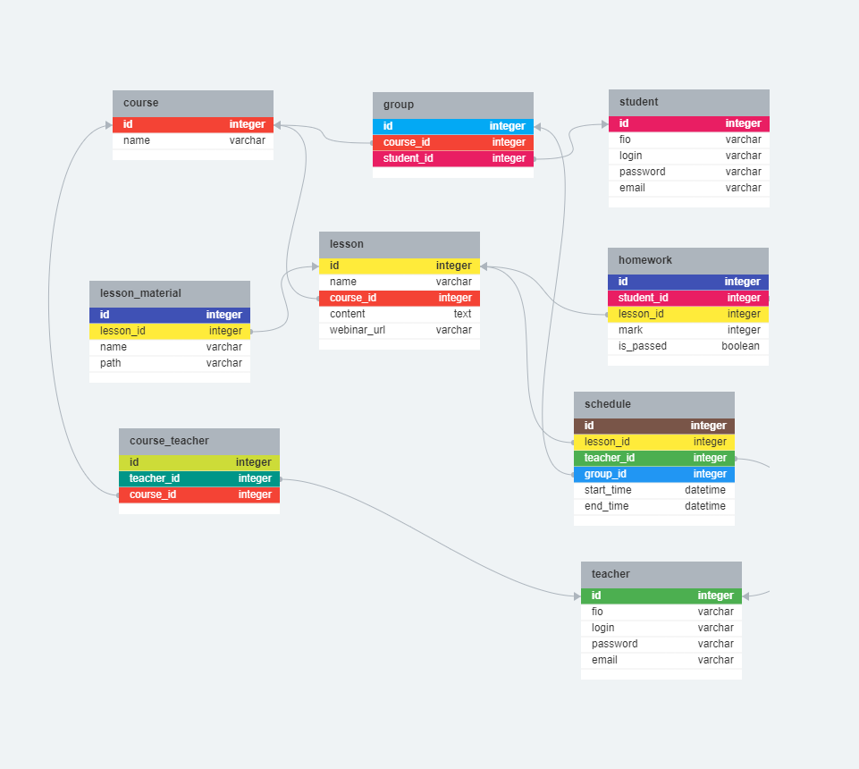

## Что это

- Домашнее задание по курсу ["JS FullStack (запуск 02.2024)"](https://greenatomcaselab.ispringlearn.ru/content/info/18595)
- Лекция 4: [Базы данных](https://greenatomcaselab.ispringlearn.ru/content/info/18790/from/18610)

## Задание

Продумать и разработать базу данных для (на выбор):
1) todo-листа
2) интернет-магазина
3) социальной сети
4) системы управления обучающими курсами

## Решение
Спроектируем БД для "системы управления обучающими курсами".

- редактор схемы: [erd.dbdesigner.net](https://erd.dbdesigner.net/designer/schema/1709128408-untitled) 
- см. результаты в файле:
[courses_db.sql](courses_db.sql) 
 
